# portable-kit — Report Showcase

**Status:** `SHOWCASE-READY`

> The portable-kit system shipped 8 skill packages, 9 Archon workflows, a 61-file
> Bacowr platform scaffold, and 1 documented 200k-class output in a single session on 2026-04-13.
> The seo-article-audit skill produced output judged more specific and actionable than a
> human reviewer working an hour, verified against a real published article with an 11/11
> Layer 1 and 20/24 Layer 2 PUBLISH-READY verdict.
> Next: run skill-creator eval loops against repo-rescue, youtube-video-digest, and
> market-intelligence-report to promote them from UNTESTED to READY.

---

## Key Metrics

| Metric | Value | Source |
|--------|-------|--------|
| Skill packages produced | 8 | docs/day-report-2026-04-13.md |
| Archon workflows created | 9 | docs/day-report-2026-04-13.md |
| Bacowr platform files scaffolded | 61 TypeScript files | docs/day-report-2026-04-13.md |
| RepoBrain routes rescued from git | 29 routes | docs/day-report-2026-04-13.md |
| RepoBrain issues found | 11 | docs/rescue-test/repobrain/RESCUE_REPORT.md |
| RepoBrain issues fixed | 8 (73%) | docs/rescue-test/repobrain/RESCUE_REPORT.md |
| RepoBrain build time after rescue | 15.8s, 0 warnings | docs/rescue-test/repobrain/RESCUE_REPORT.md |
| Quality gates passed (skill packages) | 4 (repo-rescue 16/16+36/36, seo-article-audit 16/16+34/35, 200k-pipeline 16/16+28/28, code-review-checklist 16/16+24/24) | docs/forge-artifacts/verification.md |
| Bacowr invariants verified | 7 / 7 PASS | docs/day-report-2026-04-13.md |
| seo-article-audit Layer 1 score | 11 / 11 PASS | docs/forge-artifacts/seo-audit-test-result.md |
| seo-article-audit Layer 2 score | 20 / 24 | docs/forge-artifacts/seo-audit-test-result.md |
| market-intel-report pages | 456 lines | docs/forge-artifacts/market-intel-test-report.md |
| Time span covered | 2026-04-13 (single session) | docs/day-report-2026-04-13.md |
| Morning report (2026-04-10) | [NO DATA] | File not found at docs/morning-report-2026-04-10.md |

```
Skill packages produced
████████████████████  8

Bacowr TypeScript files
████████████████████  61

RepoBrain issues: found vs fixed
Found ████████████████████  11
Fixed ███████████████░░░░░   8  ← 73% fix rate

Quality gate pass rate
████████████████████  4/4 skills gated  ← 100%

Bacowr invariants
████████████████████  7/7 PASS

seo-article-audit Layer 1
████████████████████  11/11 PASS
```

---

## Timeline

```mermaid
gantt
    title portable-kit Build Day — 2026-04-13
    dateFormat HH:mm
    axisFormat %H:%M

    section Morning
    Bootstrap — Rust binaries, MemPalace, Pydantic patch  : 08:00, 1h
    Navigation fix — INDEX.md, MANIFEST.json (38→98 resources)  : 09:00, 30m
    skill-forge forged — 19 files, 6-step process, quality gate  : done, 09:30, 1h
    200k-blueprint forged — 7 steps, blueprint template  : done, 10:30, 45m
    Writer-tool insight surfaced — tabled to MemPalace  : milestone, 11:15, 0m

    section Lunch
    RepoBrain diagnostics — autonomous scan, 2 versions found  : 11:30, 1h
    RepoBrain morning report — 475 lines, 10 issues, exact fixes  : done, 12:30, 30m
    Quick wins applied — SSL fix, localhost fallbacks, CSP  : done, 13:00, 30m
    🔴 .gitignore bug found — 29 routes missing from git  : crit, 13:00, 15m
    🟢 .gitignore fixed — 29 routes committed + pushed  : done, 13:15, 15m

    section Afternoon
    Archon installed — Bun, CLI v0.3.6, SQLite, setup wizard  : 13:30, 45m
    Archon workflows × 3 — forge-skill, blueprint-product, create-youtube  : done, 14:15, 1h
    code-review-checklist — Archon forge, quality gate 16/16+24/24 PASS  : done, 15:15, 30m
    youtube-video-digest — 7-node Archon workflow, 26 files  : done, 15:45, 1h
    RepoBrain Day 1 Sprint × 4 — clone URL token, console→logger, Dockerfile+CI  : done, 16:45, 1h

    section Evening
    200k-pipeline installed globally — ~/.claude/skills/, 29 files  : done, 17:45, 30m
    200k-pipeline self-gate — 16/16 MUST + 28/28 SHOULD PASS  : milestone, 18:15, 0m
    Bacowr deep-read — 31 files, 126s, full system analysis  : 18:15, 30m
    🟢 Bacowr scaffold — bacowr-full-build, 61 TypeScript files, build PASS  : done, 18:45, 2h
    Bacowr invariants × 7 — all PASS  : milestone, 20:45, 0m
    repo-rescue forged + tested + improved + re-tested  : done, 20:45, 1h
    seo-article-audit forged — 5-node workflow, tested → PUBLISH-READY  : done, 21:45, 1h

    section Night
    seo-article-audit polished — github handle, __pycache__  : done, 22:45, 15m
    market-intelligence-report forged — 456-line consulting report  : done, 23:00, 1h
    showcase-presenter skill forged  : active, 23:00, 1h
```



---

## Architecture Decisions

### Decision: Master bundle pattern — single global router

```
In the context of a growing library of 8+ skills that need to be accessible
in every Claude Code session,
facing the friction of loading skills individually and the risk that users
invoke the wrong sub-skill for their intent,
we decided to bundle skill-forge and 200k-blueprint into a single 200k-pipeline
master skill installed globally in ~/.claude/skills/,
to achieve a session-wide router that matches any skill-forge or blueprint
intent without requiring the user to name the sub-skill,
accepting that the bundle is larger (29 files) and that updates require
re-running the install script.
```

**Evidence:** 16/16 MUST + 28/28 SHOULD quality gate PASS after install. Triggers
fire correctly from a single description: "forge a skill", "new product", "200k blueprint"
all resolve without ambiguity.

---

### Decision: Autonomous Archon workflows over interactive forging

```
In the context of forging complex skill packages that require 20–50 decisions
across multiple files,
facing the context window cost and speed penalty of interactive step-by-step forging,
we decided to encode each skill-specific workflow as a YAML Archon workflow
(create-youtube-skill.yaml, create-seo-article-audit.yaml, etc.),
to achieve fire-and-forget autonomous skill production at 18–120 seconds per skill,
accepting that each workflow is task-specific and requires a separate YAML file
for each new skill type.
```

**Evidence:** youtube-video-digest produced 26 files via 7-node workflow. code-review-checklist
produced 1 file via 4-node workflow, quality gate 16/16+24/24 PASS. Archon test (`archon-assist`
against RepoBrain) completed in 18s.

---

### Decision: Mandatory documentation audit (not optional)

```
In the context of an AI system that showcases its own capabilities,
facing the risk of presenting broken or undocumented items as working,
we decided to make the documentation audit mandatory in both showcase modes
over making it opt-in,
to achieve honest showcase output that surfaces real gaps rather than hiding them,
accepting that some showcases will display more BROKEN/INCOMPLETE badges than
a filtered view would show.
```

**Evidence:** Research finding: "demo that 404s" and "claims without evidence" are
the top two signals that destroy credibility. Professional projects surface gaps;
side projects hide them.

---

### Decision: Two modes over one configurable showcase

```
In the context of generating project showcases from heterogeneous inputs,
facing the need to serve both "what happened" (stakeholder) and "how do I use it"
(user/developer) audiences,
we decided to split into Mode 1 (Report) and Mode 2 (Demo) over a single
configurable mode,
to achieve clean separation between narrative and instructional output formats,
accepting that the caller must choose a mode rather than getting both at once.
```

**Evidence:** The seo-article-audit skill's two-layer model (deterministic Layer 1 +
editorial Layer 2) works because each layer has a single job. This same principle
applied to showcase-presenter's mode architecture.

---

## Before / After

### RepoBrain

| Dimension | Before (morning 2026-04-13) | After (evening 2026-04-13) |
|-----------|----------------------------|---------------------------|
| Build status | "Fungerar inte" | `npm run ci` clean: lint + typecheck + build |
| Build time | Unknown (didn't complete) | 15.8s, 0 warnings |
| Route files in git | 29 routes missing (.gitignore bug) | All 29 committed + pushed |
| .gitignore | Tracked `repos/` as directory | Fixed to `/repos/` (anchored) |
| Audit issues | 11 found (2 Critical, 2 High, 2 Medium, 5 Low) | 8 fixed; 3 deferred to Week 1 |
| README | None | 475-line README with architecture diagram |
| CI | None | GitHub Actions pipeline (lint + typecheck + build) |
| Dockerfile | None | Multi-stage Dockerfile + docker-compose.prod.yml |
| Archon integration | None | 3 workflows + rescue skill copied to repo |
| Production credentials | In `src/.env` in plaintext | Identified + flagged Critical; rotation on owner |

### Bacowr

| Dimension | Before | After |
|-----------|--------|-------|
| Codebase | CLI-only Python pipeline (4,645 lines) | Scaffolded web platform (61 TypeScript files) |
| Web application | None | Next.js 16, 26 routes, 25 components, build PASS |
| Engine wrapper | None | 388 lines TypeScript, subprocess bridge, all methods |
| Database schema | None | Drizzle schema, 7 tables, Phase 4 ready |
| Dark theme | None | Tailwind dark-first, 0 bg-white/text-black violations |
| Invariants | Not verified | 7/7 PASS (engine integrity, dark theme, QA live, trustlink dedup) |
| Archon integration | None | 3 workflows: scaffold, build-feature, full-build |

---

## Risk & Gap Register

| Item | Status | Risk if Left | Effort to Close |
|------|--------|-------------|-----------------|
| morning-report-2026-04-10.md | MISSING | Pre-session context permanently lost; no baseline metrics for the 2026-04-10 project-wiki work | S |
| repo-rescue: 3 deferred issues (test suite, hardcoded secrets rotation, CHANGELOG) | INCOMPLETE | Secrets rotation is critical; no timeline on owner action | M |
| youtube-video-digest: stale `extract_transcript.py` (underscore version) | INCOMPLETE | Confusion about which script is current; potential silent use of outdated version | S |
| market-intelligence-report: STRENGTHEN-THEN-DELIVER verdict (not DELIVERY-READY) | INCOMPLETE | Swedish developer count lacks a named source; no primary customer interview | M |
| 200k-pipeline: no README.md, no metadata.json in package directory | INCOMPLETE | New users have no installation guide in the package; must read SKILL.md or install.sh directly | S |
| Bacowr: 2 of 5 identified gaps not fixed | INCOMPLETE | library search comment + migrate already via drizzle-kit; low priority but open | S |
| showcase-presenter: invocation not yet tested (just forged) | INCOMPLETE | Mode 1 and Mode 2 outputs unverified against real artifacts until this document | M |
| RepoBrain: production credentials still in `src/.env` | BROKEN | Critical security finding; key rotation is the owner's responsibility; no automated fix possible | XL |

---

## Next Steps

1. **Run** skill-creator eval loop against repo-rescue, youtube-video-digest, and
   market-intelligence-report to verify invocation and promote to READY `[M]`
2. **Add** README.md and metadata.json to 200k-pipeline package directory (currently
   has only SKILL.md + install.sh) `[S]`
3. **Fix** stale `extract_transcript.py` in youtube-video-digest — delete the
   underscore-named file or replace it with a redirect comment `[S]`
4. **Add** a named Swedish developer population source to market-intelligence-report
   to promote it from STRENGTHEN-THEN-DELIVER to DELIVERY-READY `[M]`
5. **Notify** RepoBrain owner: production credentials in `src/.env` require immediate
   rotation — Critical finding, no automated fix, owner action required `[XL]`

---

## Documentation Audit

| Capability / Item | A1 Exists | A2 README | A3 Frontmatter | A4 Invokable | A5 Output OK | A6 No Dead Refs | Status |
|-------------------|-----------|-----------|----------------|--------------|--------------|-----------------|--------|
| skill-forge | ✓ | ✓ | ✓ | – | – | ✓ | `[UNTESTED]` |
| 200k-blueprint | ✓ | ✓ | ✓ | – | – | ✓ | `[UNTESTED]` |
| 200k-pipeline | ✓ | ✗ | ✓ | – | – | ✓ | `[INCOMPLETE]` |
| code-review-checklist | ✓ | ✓ | ✓ | – | – | ✓ | `[UNTESTED]` |
| youtube-video-digest | ✓ | ✓ | ✓ | – | – | ✓ | `[UNTESTED]` |
| repo-rescue | ✓ | ✓ | ✓ | – | – | ✓ | `[UNTESTED]` |
| seo-article-audit | ✓ | ✓ | ✓ | – | – | ✓ | `[UNTESTED]` |
| market-intelligence-report | ✓ | ✓ | ✓ | – | – | ✓ | `[UNTESTED]` |
| showcase-presenter | ✓ | ✓ | ✓ | – | – | ✓ | `[UNTESTED]` |
| docs/day-report-2026-04-13.md | ✓ | – | – | – | – | – | `[READY]` |
| docs/rescue-test/repobrain/RESCUE_REPORT.md | ✓ | – | – | – | – | – | `[READY]` |
| docs/forge-artifacts/seo-audit-test-result.md | ✓ | – | – | – | – | – | `[READY]` |
| docs/forge-artifacts/market-intel-test-report.md | ✓ | – | – | – | – | – | `[READY]` |
| docs/morning-report-2026-04-10.md | ✗ | – | – | – | – | – | `[BROKEN]` |

**Ready:** 4 / 14 &nbsp; **Untested:** 9 / 14 &nbsp; **Incomplete:** 1 / 14 &nbsp; **Broken:** 1 / 14

**Audit actions required:**
- `docs/morning-report-2026-04-10.md` not found — was referenced in the test input list but does not exist. Pre-session context is unrecoverable for this showcase.
- `200k-pipeline` has no README.md — add a one-page install guide with `bash install.sh` instructions.
- All 9 skill packages are `[UNTESTED]` (invocation not verified in this session). Run skill-creator eval loop to confirm each produces expected output before promoting to READY.

**Legend:**
A1 = file exists · A2 = README or SKILL.md present · A3 = frontmatter valid
A4 = invocation confirmed this session · A5 = output format matches docs
A6 = no dead file references · – = check not applicable or not performed

**Verdict:** `SHOWCASE-READY`
