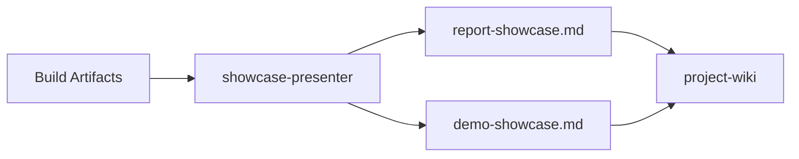
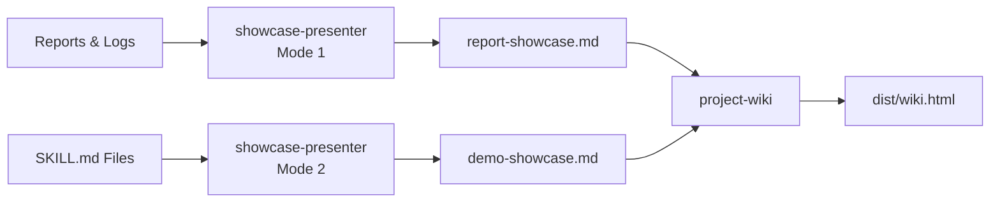
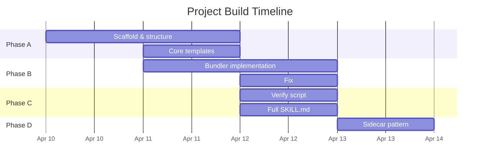
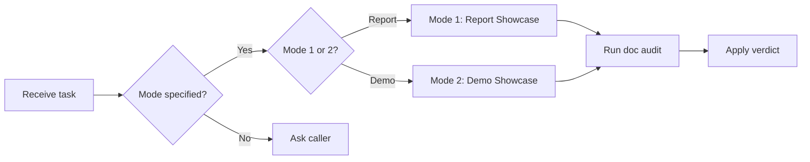
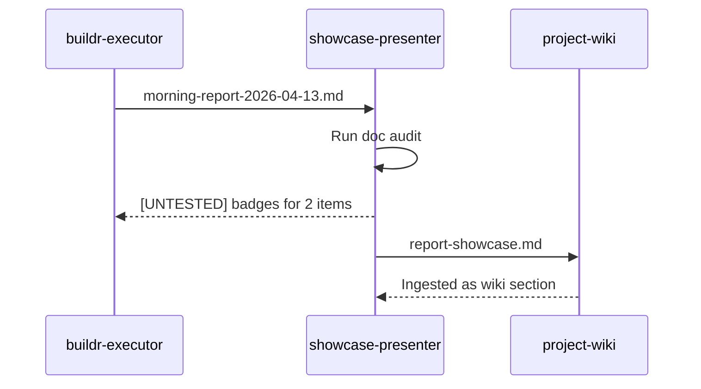

# Mermaid Cheatsheet

> **When to read this:** When building the timeline (gantt), architecture diagram,
> or any visualization in a showcase document. Use this instead of searching docs.

---

## Rule: Mermaid for All Architecture Visualizations

All architecture diagrams in showcase output use Mermaid syntax. ASCII art is for
metrics bars only. Mermaid renders in GitHub, GitLab, Notion, and most markdown
viewers — it is the right default.

---

## Diagram Type Selection

| What you're showing | Use | Avoid |
|--------------------|-----|-------|
| System architecture (components + connections) | `graph LR` or `graph TD` | ASCII boxes |
| Build timeline (phases + dates) | `gantt` | Markdown table alone |
| Decision flow (if/then branches) | `flowchart LR` | Prose |
| Data model (entities + relations) | `erDiagram` | — |
| Sequence (agent A calls agent B) | `sequenceDiagram` | — |
| State machine | `stateDiagram-v2` | — |

---

## `graph` — Component Architecture



**Syntax rules:**
- `graph LR` — left to right (use for pipelines and data flows)
- `graph TD` — top to bottom (use for hierarchies)
- `A[Label]` — rectangle node
- `A([Label])` — rounded rectangle
- `A{Label}` — diamond (decision)
- `A[(Label)]` — cylinder (database/store)
- `A --> B` — arrow with open head
- `A -->|label| B` — labelled edge
- `A --- B` — line without arrow
- `subgraph Title` ... `end` — group nodes

**Real example — portable-kit skill pipeline:**


---

## `gantt` — Build Timeline



**Syntax rules:**
- `dateFormat YYYY-MM-DD` — input format for dates (do not change)
- `axisFormat %b %d` — display format (Month Day)
- `section Name` — groups tasks
- `Task name : start, duration` or `Task name : start, end`
- `Task name : crit, start, end` — mark as critical (renders in red/accent)
- `Task name : done, start, end` — mark as completed
- `Task name : active, start, end` — mark as in-progress

**Anti-pattern:** Do not use gantt when you have fewer than 4 tasks or a single phase.
Use a markdown table instead — gantt overhead is not worth it for simple timelines.

---

## `flowchart` — Decision Flow



**Use `flowchart` over `graph` when:** The diagram has decision diamonds (`{}`).

---

## `sequenceDiagram` — Agent Interactions



**Syntax rules:**
- `participant A as Label` — declare with alias
- `A->>B: message` — solid arrow (synchronous call)
- `A-->>B: message` — dashed arrow (response/async)
- `A-xB: message` — cross (failure/rejection)
- `Note over A,B: text` — annotation spanning participants

---

## Common Mistakes

| Mistake | Fix |
|---------|-----|
| Quotes in node labels break parsing | Escape with `&quot;` or avoid quotes |
| Long labels push diagram off-screen | Use `<br/>` for line breaks within labels: `A["Line 1<br/>Line 2"]` |
| Gantt dates in wrong format | Always `YYYY-MM-DD` for input |
| `graph` and `flowchart` mixed | Pick one — `flowchart` is the modern alias for `graph` |
| Subgraph name contains special chars | Wrap in quotes: `subgraph "Phase A: Setup"` |
| Empty diagram block | Must have at least one node or Mermaid throws a parse error |
| Emojis in task names (🔴, 🟢) | Supported in Mermaid v10+ (GitHub uses v10.6.1); test in target viewer before using |

---

## ASCII Charts (Metrics Only)

ASCII bars are for the metrics dashboard — they work in every terminal and markdown
viewer without rendering support.

```
# Bar chart construction:
# filled_blocks = round(value / max_value * 20)
# empty_blocks = 20 - filled_blocks
# Bar = "█" × filled_blocks + "░" × empty_blocks

Files created  ████████████████████  48  (48/48 = 20 blocks)
Files modified █████░░░░░░░░░░░░░░░  12  (12/48 × 20 = 5 blocks)
Files deleted  ░░░░░░░░░░░░░░░░░░░░   0

Commands OK    ████████████████████  47  (47/51 × 20 = 18 blocks)
Commands fail  ██░░░░░░░░░░░░░░░░░░   4
```

**Rules:**
- Use `█` (U+2588) for filled and `░` (U+2591) for empty
- Always normalize to the same max value within a group
- Include the raw number after the bar
- Wrap in a fenced code block (no language tag) so monospace rendering is guaranteed
